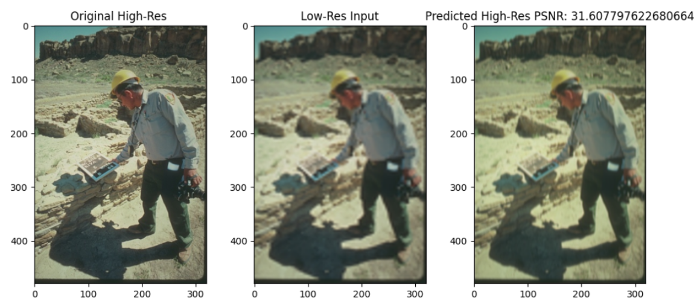

  # FSRCNN (Fast Super Resolution Convolutional Neural Networks)

## Objective
The aim of the project is to implement the **FSRCNN Model** which deals with conversion of Low Resolution images to High Resolution images with the help of Convolutional Neural Networks

## Approach
1. Firstly we started with learning basic concepts of Neural Netwokrs and Machine Learning.
2. With this knowledge we started the implementation of the handwritten digit recognition model (MNIST dataset) by a simple 2 layer ANN , using numpy from scratch.
3. Further we learned the basic concepts of Optimizers, Hyperparameter tuning, Convolutional Neural Networks and studied its various architectures.
4. Then we implemented the MNIST model using the PyTorch framework (Firstly using a 2 layer ANN and then by using a Deep CNN architecture).
5. Furthermore we also implemented an object detection model based on the CIFAR-10 dataset using a Deep CNN architecture along with batch normalization and dropout regularization.
6. Then we implemented a custom dataloader to extract the raw High Res and Low Res images from the BSD-100 dataser which would be further used as train and test datasets for the implementation of SRCNN and FSRCNN.
7. We implemented the SRCNN architecture in PyTorch for the BSD-100 dataset, taking reference for the architecture from the following research paper :-
["Image Super-Resolution Using Deep Convolutional Networks"](https://arxiv.org/abs/1501.00092).
8. Finally we implemented the FSRCNN architecture for the same dataset. Reference from the following research paper :- 
["Accelerating the Super-Resolution Convolutional Neural Network"](https://arxiv.org/pdf/1608.00367v1.pdf)

## SRCNN

### MODEL ARCHITECTURE

## Algorithm 
1. The low resolution image is first upscaled to the required size using Bicubic interpolation, which is followed by 3 operations.
2. **Patch Extraction and Representation**: This operation extracts (overlapping) patches from the upscaled low resolution image (**Y**) and represents each patch as a high-dimensional vector through a 2D convolution operation. Our first layer can be expressed as an operation : **F1(Y) = max (0, W1 ∗ Y + B1)**
3. **Non-linear mapping**: This operation nonlinearly maps each high-dimensional vector onto another high-dimensional vector. The convolution operation of the second layer is : **F2(Y) = max (0, W2 ∗ F1(Y) + B2)**
4. **Reconstruction**: This operation aggregates the above high-resolution patch-wise representations to generate the final high-resolution image. This can be represented by a convolutional operation as : **F(Y) = W3 ∗ F2(Y) + B3**
5. **Training**:  For training the model we calculate the pixel-wise loss between the predicted output (**Y**) and the original high resolution image (**X**). The loss function is given by the Mean Squared Error (MSE) function as :

  

However to extract more spatial features and to avoid possible discrepancies in MSE loss due to changed orientation of images , the loss function is added to another loss function called Perceptual Loss. here the target and predicted images are passed through a pre-trained VGG-19 / 16 (Image Classification model) upto a certain layer , where the mse loss of the low-level features is added to the original loss function. 

## Results
Results obtained for **f1 = 9 , f2 = 5 , f3 = 5 , n1 = 64 , n2 = 32 , n3 = 3**

## FSRCNN

### MODEL ARCHITECTURE

## Algorithm
1. FSRCNN can be decomposed into five parts – feature extraction, shrinking, mapping, expanding and deconvolution. The first 4 layers are a convolution operation. The model can be viewed as an Hourglass-like architecture. 
2. **Feature Extraction**: FSRCNN performs feature extraction on the original LR image without interpolation. This operation can be represented by **Conv(5, d, 1)**.
3. **Shrinking**: In SRCNN the mapping step has high complexity due to size of the Low-res dimension feature vectors, hence a 1x1 convolution is used to reduce the size of the Low Resolution feature maps. This step can be represented by **Conv(1, s, d)**.
4. **Non-linear mapping**: The non-linear mapping step is the most important step which is mainly affected by the no of filters used and depth of the mapping (m). It can be denoted by the convolution operation **m × C onv(3, s, s)**
5. **Expanding**: This layer is added to invert the effects of shrinking which was mainly added to reduce computational complexity. This layer needs to be used rather than directly reconstructing the High resolution image to avoid poor restoration quality. This step can be represented by **Conv(1, d, s)**.
6. **Deconvolution**: This layer upsamples and aggregates the previous features with a set of Deconvolution filters (which are basically an inverse operation of convolutions) to generate the final High resolution image. This layer can be represented by as **DeConv(9, 1, d)**.
7. **Training**: Just as similar to SRCNN , in FSRCNN the loss function can be calcularted through a weighted combination of the pixel-wise MSE loss and the Low-level features based Perceptual Loss calculated using a pre-trained VGG-19 / 16 model.

## Results
