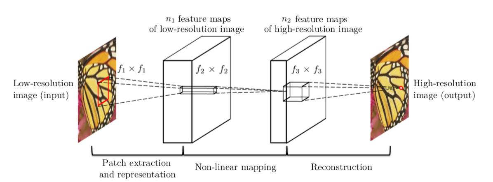

# **FSRCNN (Fast Super Resolution Convolutional Neural Networks)**

##  **Table of Contents**
- [**FSRCNN (Fast Super Resolution Convolutional Neural Networks)**](#fsrcnn-fast-super-resolution-convolutional-neural-networks)
  - [**Table of Contents**](#table-of-contents)
  - [**Objective**](#objective)
  - [**Approach**](#approach)
  - [**SRCNN**](#srcnn)
    - [Model Architecture](#model-architecture)
  - [**Algorithm**](#algorithm)
  - [**Results**](#results)
  - [**FSRCNN**](#fsrcnn)
    - [Model Architecture](#model-architecture-1)
  - [**Algorithm**](#algorithm-1)
  - [**Results**](#results-1)
  - [**Key Differences Between FSRCNN and SRCNN**](#key-differences-between-fsrcnn-and-srcnn)
    - [1. Network Structure](#1-network-structure)
    - [2. Pre-processing](#2-pre-processing)
    - [3. Upsampling Method](#3-upsampling-method)
    - [4. Speed](#4-speed)
    - [5. Number of Parameters](#5-number-of-parameters)
    - [6. Model Complexity](#6-model-complexity)
    - [7. Training Efficiency](#7-training-efficiency)
    - [8. Memory Usage](#8-memory-usage)
    - [9. Accuracy and Quality](#9-accuracy-and-quality)
    - [10. Scalability to Different Scaling Factors](#10-scalability-to-different-scaling-factors)
  - [**Why FSRCNN is Better Than SRCNN**](#why-fsrcnn-is-better-than-srcnn)

---
## **Objective**
The aim of the project is to implement the **FSRCNN Model** which deals with conversion of Low Resolution images to High Resolution images with the help of Convolutional Neural Networks

## **Approach**
1. Firstly we started with learning basic concepts of Neural Networks and Machine Learning.
2. With this knowledge we started the implementation of the handwritten digit recognition model (MNIST dataset) by a simple 2 layer ANN , using NumPy from scratch.
3. Further we learned the basic concepts of Optimizers, Hyperparameter tuning, Convolutional Neural Networks and studied its various architectures.
4. Then we implemented the MNIST model using the PyTorch framework (Firstly using a 2 layer ANN and then by using a Deep CNN architecture).
5. Furthermore, we also implemented an object detection model based on the CIFAR-10 dataset using a Deep CNN architecture along with batch normalization and dropout regularization.
6. Then we implemented a custom data loader to extract the raw High Res and Low Res images from the BSD-100 dataset which would be further used as train and test datasets for the implementation of SRCNN and FSRCNN.
7. We implemented the SRCNN architecture in PyTorch for the BSD-100 dataset, taking reference for the architecture from the following research paper :-
["Image Super-Resolution Using Deep Convolutional Networks"](https://arxiv.org/abs/1501.00092).
8. Finally, we implemented the FSRCNN architecture for the same dataset. Reference from the following research paper :- 
["Accelerating the Super-Resolution Convolutional Neural Network"](https://arxiv.org/pdf/1608.00367v1.pdf)

---

## **SRCNN**

### Model Architecture

## **Algorithm** 
1. The low resolution image is first upscaled to the required size using Bicubic interpolation, which is followed by 3 operations.
2. **Patch Extraction and Representation**: This operation extracts (overlapping) patches from the upscaled low resolution image (**Y**) and represents each patch as a high-dimensional vector through a 2D convolution operation. Our first layer can be expressed as an operation : **F1(Y) = max (0, W1 ∗ Y + B1)**
3. **Non-linear mapping**: This operation nonlinearly maps each high-dimensional vector onto another high-dimensional vector. The convolution operation of the second layer is : **F2(Y) = max (0, W2 ∗ F1(Y) + B2)**
4. **Reconstruction**: This operation aggregates the above high-resolution patch-wise representations to generate the final high-resolution image. This can be represented by a convolutional operation as : **F(Y) = W3 ∗ F2(Y) + B3**
5. **Training**:  For training the model we calculate the pixel-wise loss between the predicted output (**Y**) and the original high resolution image (**X**). The loss function is given by the Mean Squared Error (MSE) function as :

  

However, to extract more spatial features and to avoid possible discrepancies in MSE loss due to changed orientation of images , the loss function is added to another loss function called Perceptual Loss. here the target and predicted images are passed through a pre-trained VGG-19 / 16 (Image Classification model) up to a certain layer , where the MSE loss of the low-level features is added to the original loss function. 

## **Results**
Results obtained for **f1 = 9 , f2 = 5 , f3 = 5 , n1 = 64 , n2 = 32 , n3 = 3**

---

## **FSRCNN**

### Model Architecture

## **Algorithm**
1. FSRCNN can be decomposed into five parts – feature extraction, shrinking, mapping, expanding and deconvolution. The first 4 layers are a convolution operation. The model can be viewed as an Hourglass-like architecture. 
2. **Feature Extraction**: FSRCNN performs feature extraction on the original LR image without interpolation. This operation can be represented by **Conv(5, d, 1)**.
3. **Shrinking**: In SRCNN the mapping step has high complexity due to size of the Low-res dimension feature vectors, hence a 1x1 convolution is used to reduce the size of the Low Resolution feature maps. This step can be represented by **Conv(1, s, d)**.
4. **Non-linear mapping**: The non-linear mapping step is the most important step which is mainly affected by the number of filters used and depth of the mapping (m). It can be denoted by the convolution operation **m × Conv(3, s, s)**
5. **Expanding**: This layer is added to invert the effects of shrinking which was mainly added to reduce computational complexity. This layer needs to be used rather than directly reconstructing the High resolution image to avoid poor restoration quality. This step can be represented by **Conv(1, d, s)**.
6. **Deconvolution**: This layer upsamples and aggregates the previous features with a set of Deconvolution filters (which are basically an inverse operation of convolutions) to generate the final High resolution image. This layer can be represented by as **DeConv(9, 1, d)**.
7. **Training**: Just as similar to SRCNN , in FSRCNN the loss function can be calculated through a weighted combination of the pixel-wise MSE loss and the Low-level features based Perceptual Loss calculated using a pre-trained VGG-19 / 16 model.

## **Results**

---

## **Key Differences Between FSRCNN and SRCNN**

### 1. Network Structure
- **SRCNN**: Consists of a simple three-layer convolutional neural network.
- **FSRCNN**: Utilizes a more complex structure with multiple convolutional layers and upscaling operations integrated into the network.

### 2. Pre-processing
- **SRCNN**: Works on **upscaled low-resolution images** as input. Bicubic interpolation is used to upscale the input image before applying the network.
- **FSRCNN**: Directly processes the **low-resolution image** and learns the upscaling operation within the network, eliminating the need for bicubic interpolation.

### 3. Upsampling Method
- **SRCNN**: Upsampling is done **outside** the model using bicubic interpolation before feeding the input image into the network.
- **FSRCNN**: Performs **upsampling inside** the network at the final stage using a deconvolution (transposed convolution) layer, which is learned rather than predefined.

### 4. Speed
- **SRCNN**: Slower due to the need for external bicubic interpolation and processing of larger upsampled images.
- **FSRCNN**: Faster because it processes smaller low-resolution images and upscales them internally, reducing computational cost.

### 5. Number of Parameters
- **SRCNN**: Has more parameters due to its simpler structure but operates on upscaled images, which increases the computational load.
- **FSRCNN**: Has fewer parameters because of the smaller input image size and internal upscaling mechanism, leading to faster execution and lower memory usage.

### 6. Model Complexity
- **SRCNN**: Simpler architecture with fewer convolutional layers, making it easier to train but limited in learning capacity.
- **FSRCNN**: More complex architecture with a shrinking layer, non-linear mapping, and an expanding layer, which allows it to learn more complex mappings and enhance image quality.

### 7. Training Efficiency
- **SRCNN**: Requires more training time since it works with larger upscaled images and needs to learn on higher-dimensional inputs.
- **FSRCNN**: More efficient to train due to working on lower-resolution images and having fewer parameters to optimize.

### 8. Memory Usage
- **SRCNN**: Consumes more memory during training and inference due to the larger size of the input (upscaled image).
- **FSRCNN**: Consumes less memory as it operates on smaller images throughout most of the network and only upscales them at the end.

### 9. Accuracy and Quality
- **SRCNN**: Produces good results but may struggle with very fine details and high-frequency information.
- **FSRCNN**: Generally, provides **better super-resolution quality**, especially in fine details, due to the enhanced architecture and learned upsampling.

### 10. Scalability to Different Scaling Factors
- **SRCNN**: Scaling factors (e.g., 2x, 3x, 4x) are predefined, requiring separate models to be trained for each scale.
- **FSRCNN**: More flexible and can handle multiple scaling factors with a single model, thanks to the internal upsampling layer.

## **Why FSRCNN is Better Than SRCNN**

1. **Speed**: FSRCNN is significantly faster due to processing lower-resolution images and upscaling within the network. This makes it more suitable for real-time applications.
   
2. **Parameter Efficiency**: FSRCNN achieves super-resolution with fewer parameters and less memory, making it more computationally efficient, especially on resource-constrained devices.

3. **Better Performance**: FSRCNN delivers better image quality in terms of sharpness and fine details. The internal upscaling and advanced architecture allow it to reconstruct higher-quality images than SRCNN.

4. **Scalability**: FSRCNN is more versatile as it can handle multiple scaling factors with a single model, whereas SRCNN requires different models for different scales.

---
---

=======
## Results

## Datasets
| Dataset  |  Link  |
|:-------: | :-----:|
| BSD-100  | ["Click"](https://figshare.com/ndownloader/files/38256840) |
| Set-5    | ["Click"](https://figshare.com/ndownloader/files/38256852) |
| Set-14   | ["Click"](https://figshare.com/ndownloader/files/38256855) |
| Urban100 | ["Click"](https://figshare.com/ndownloader/files/38256858) |

